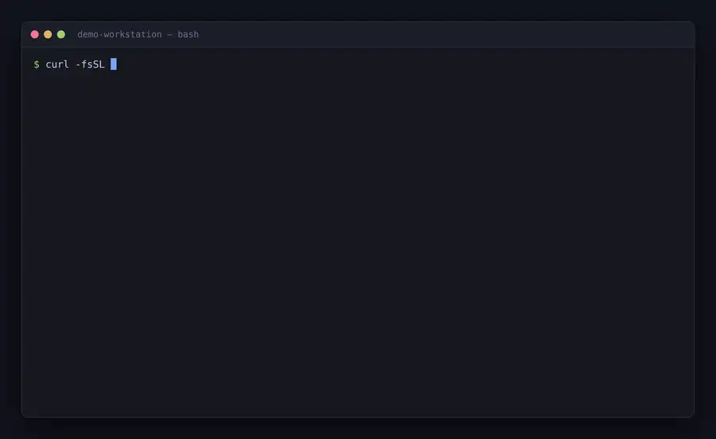
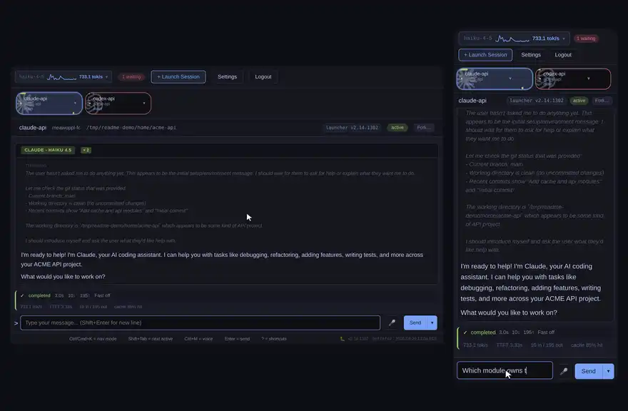
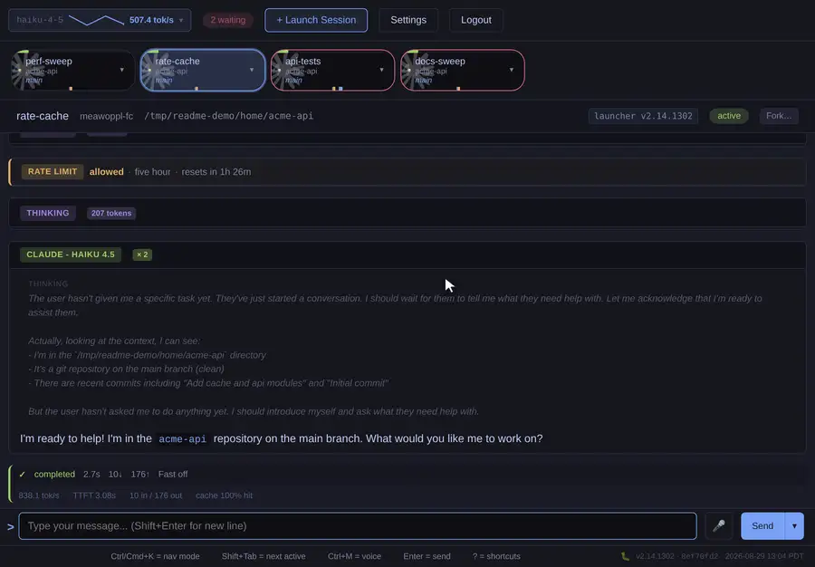
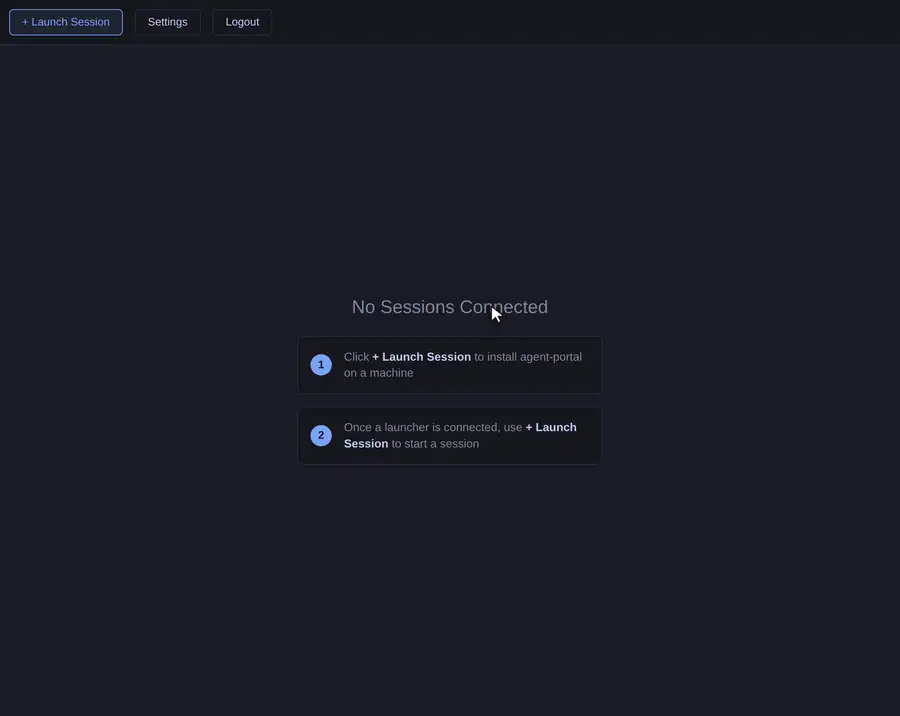
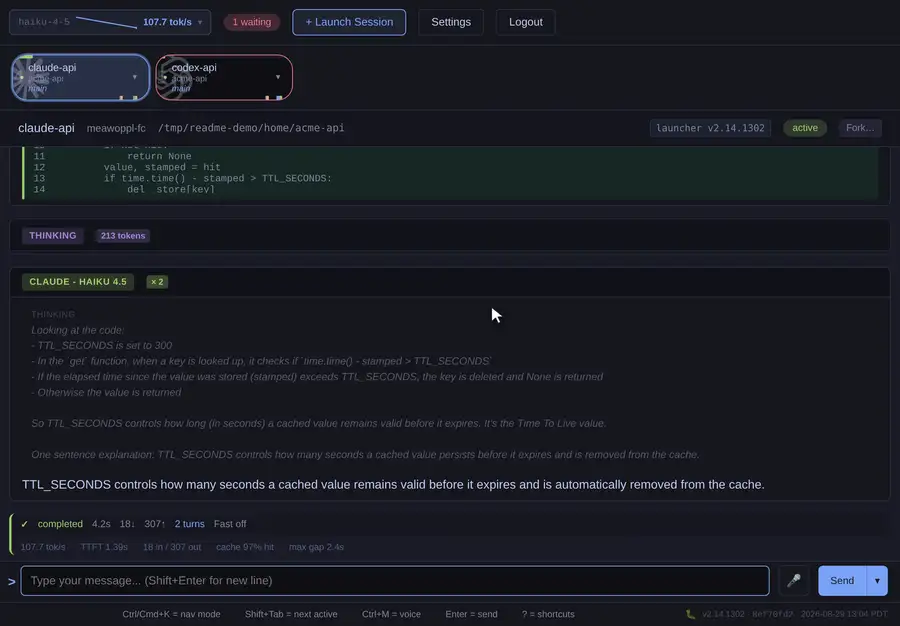
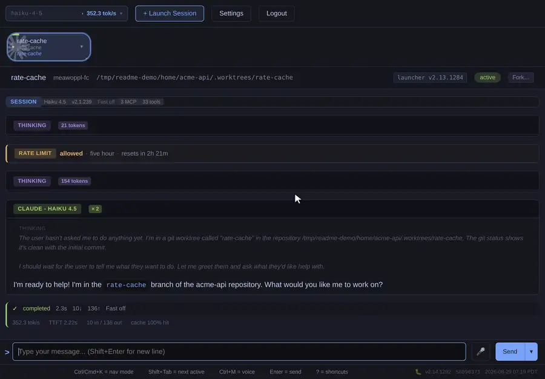
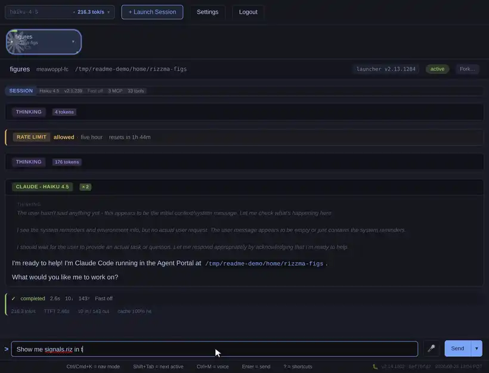
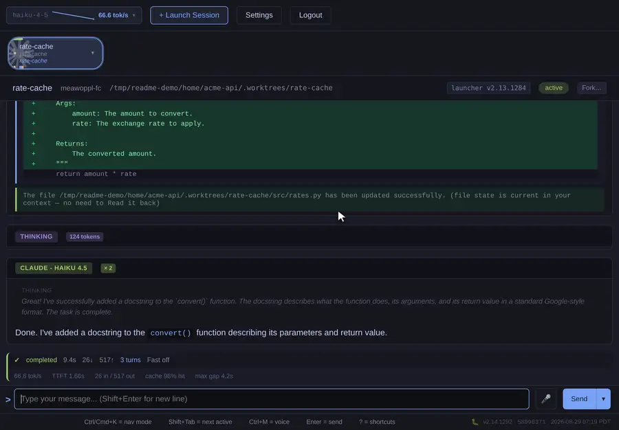
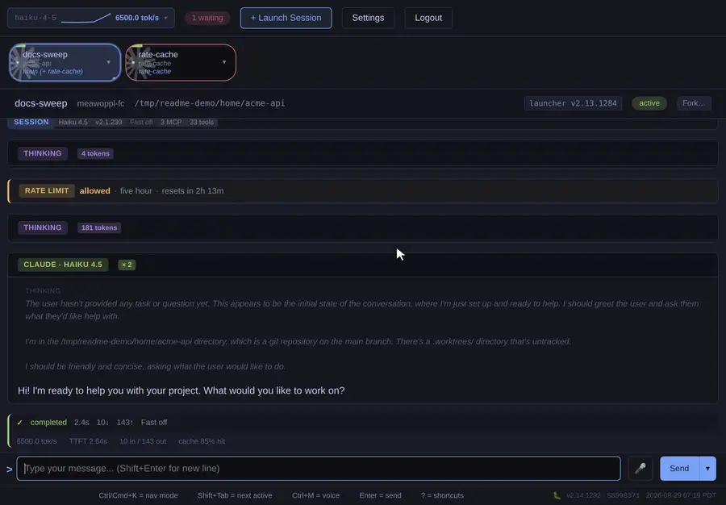
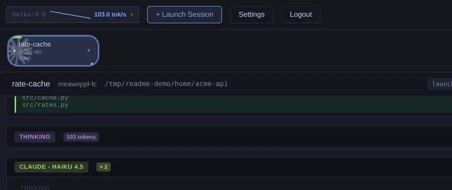

# Agent Portal — Try It: [txcl.io](https://txcl.io)

Run coding agents on your own machines and drive them from any browser.

Agent Portal puts a persistent daemon on each of your computers, connects it to
a server you (or we) host, and gives you a live, shareable web UI for every
agent session on every machine — from a phone, a laptop, or a tab you left open
yesterday. Hand a task to an agent on your workstation, close the lid, and pick
it up on the train: the transcript, the cost, the pending permission prompt and
the dev server it just started are all still there.

It is Rust end to end — Axum server, Yew/WebAssembly frontend, a launcher
daemon, and a typed WebSocket protocol shared by all of them.

Supported agents: **Claude Code**, **OpenAI Codex**, and **Meta Muse Code**
(experimental).

[Features Anthropic Missed](https://www.loom.com/share/38bdd5406c2443ff8c978d5d5b01e967)

---

## Quick Start

### Use the hosted portal

On each machine you want to run agents on:

```bash
curl -fsSL "https://txcl.io/api/download/install.sh" | bash

agent-portal login             # browser device-code sign-in
agent-portal service install   # run as a systemd / launchd service
```



Then open **[txcl.io](https://txcl.io)**, and launch a session on that machine
straight from the dashboard — pick the directory, agent, model, and whether to
work in a fresh git worktree.

Already have an agent running in a terminal or in VS Code? Wrap it instead and
it shows up on the same dashboard:

```bash
claude-portal --backend-url wss://txcl.io -- --model opus
```

### Run the whole thing locally

```bash
git clone https://github.com/meawoppl/agent-portal.git
cd agent-portal
./scripts/dev.sh start     # DB + backend + frontend, auto-installs deps
```

Open **http://localhost:3000/** — dev mode logs you in as
`testing@testing.local`. See [Local Development](docs/LOCAL_DEVELOPMENT.md).

---

## Features

### Sessions from anywhere

- **Live, not a replay.** Output streams as the agent produces it; sending a
  message from your phone lands mid-flight.
- **Reconnects don't lose transcript.** Replay resumes from a server-assigned
  watermark, and web input rides a client-side outbox with idempotency keys, so
  a dropped connection never drops or duplicates a message.
- **Every device.** The frontend is responsive on phones and tablets; a Tauri
  iOS/Android shell in-tree adds native push, deep links, and share targets.
- **Keyboard-first.** `Ctrl/Cmd+K` enters nav mode — jump between sessions,
  `w` to hop to the next one waiting on you, scroll transcripts without leaving
  the keyboard. Press `?` for the full list.
- **History.** Finished sessions stay browsable and searchable as an overlay,
  including transcripts restored from long-term archive.





### One dashboard, many agents

- **Three agent CLIs**, each with a renderer that speaks its own protocol:
  Claude's role-tagged messages, Codex's thread/turn events, Muse's
  event-sourced journal.
- **Install and sign in from the web.** The Computers tab probes each machine
  for which agent CLIs are present, installs the missing ones, and drives the
  agent's own login flow — device codes and all — without you SSH-ing anywhere.
- **Model picker** fed by the SDK crates' model catalogs, per launch.
- **Fork a session** into a new git worktree to try a second approach without
  disturbing the first.





### Rich rendering

- Markdown, syntax-highlighted **diffs**, LaTeX via KaTeX, ANSI colors, and
  purpose-built cards for bash, edits, searches, and sub-agent tasks.
- **Decisions as forms.** Permission requests and multiple-choice questions
  render as click-to-answer cards instead of walls of text.
- **Media inline.** `agent-portal show plot.png|clip.mp4|figure.riz` uploads and
  renders images, video, and interactive Rizzma portable figures into the
  transcript.
- **Downloadable artifacts.** Agents emit `portal://file/...` links that become
  secure download actions.





### Port forwarding

- `agent-portal forward 8080` from inside a session prints one URL on a stable
  per-session subdomain — the URL survives the agent moving the service to a
  different port.
- A header chip shows **live port health** (breathing green = something is
  listening, red = refused) and names the process bound to it.
- Click the chip for a **draggable, resizable preview** of the app inside the
  portal. WebSockets and SSE work through it, so Vite HMR and Jupyter kernels
  are fine.
- Private by default behind a token handoff; one toggle makes a forward public
  (and re-pointing the port resets it to private). Admins can assign
  human-readable subdomains.



See [Port Forwarding](docs/PORT_FORWARDING.md).

### Agents that talk to each other

```bash
agent-portal message list                     # your other sessions
agent-portal message send <id> "PR is up — review the auth boundary"
```

Messages arrive as a turn in the target session and reply by id, using the
session's own identity — no credential handling in agent code. One agent
writing code while another reviews it is a normal working pattern here.



### Scheduled work

Cron-style recurring tasks, pinned to a machine and evaluated locally with
timezone support. Runs **resume the same agent session**, so a nightly reviewer
remembers what it looked at yesterday. See
[Scheduled Tasks](docs/SCHEDULED_TASKS.md).

### Cost and performance visibility

- Per-turn metrics: tokens, cost, duration, cache hits, service tier.
- A cost ticker per session and activity sparklines in the session rail.
- A Performance page with plots grouped by agent, model, and tier over
  configurable windows.
- **Usage-limit continuations**: when an agent hits a provider limit, the portal
  schedules the resume for you and relaunches the session if the process exited.



### Voice input

Browser-native (Web Speech API) with no credentials required. Self-hosters can
point `PORTAL_STT_BACKEND` at one of ten hosted providers — AssemblyAI, AWS,
Azure, Deepgram, Google, IBM, OpenAI, Rev AI, Simplismart, Speechmatics — which
adds Firefox support and vocabulary biasing so `clippy`, `Diesel`, and your
branch names come back spelled correctly.

### Notifications

Web Push, APNs, and FCM for turn-complete and permission-needed events; a
notification sound designer with synthesized tones and an ADSR editor; and an
optional health-break timer that nudges you away from the screen.

### Sharing and access control

Share any session you own by email with a role — **editor** to interact,
**viewer** for read-only. Sign in with Google or GitHub; identities are keyed by
the provider's immutable subject, and linking a second provider to an account
requires a *verified* email.

### Operations

- Launchers **self-update**, install as a service, and park with an actionable
  message instead of crash-looping on bad credentials.
- Configurable message/session retention, plus optional long-term archive to
  local disk or S3 (transcripts and media included).
- Admin dashboard: users, sessions, spend, and forward subdomains.
- Stable, alertable log markers for every logged-and-continued failure path.
- `agent-portal service pastebin` uploads system info, build info, and logs to
  an unlisted paste for support.

---

## Architecture


The **launcher** (`agent-portal`) is a persistent daemon, one per machine: it
starts and supervises sessions, runs scheduled tasks, tunnels forwarded ports,
and updates itself. The **proxy** (`claude-portal`) is the per-session wrapper
that owns an agent CLI process; you only run it by hand for terminal or VS Code
sessions. The **backend** coordinates every WebSocket, persists transcripts, and
serves the **frontend**, which is compiled to WebAssembly and embedded in the
backend binary.

### Workspace

| Crate | Role |
|-------|------|
| `shared` | Types + typed WS protocol, WASM-compatible |
| `backend` | Axum server, PostgreSQL/Diesel, OAuth, reverse proxy |
| `frontend` | Yew WebAssembly app |
| `launcher` | `agent-portal` daemon and CLI |
| `proxy` | `claude-portal` per-session wrapper (incl. VS Code shim) |
| `session-lib` | Agent-agnostic session core (`Agent` trait, `Session<A>`, tunnel) |
| `claude-session-lib` / `codex-session-lib` / `muse-session-lib` | Per-agent backends |
| `portal-auth` | Shared OAuth device-flow client |
| `portal-stt` | Speech-to-text provider implementations |
| `portal-update` | Shared auto-update logic |
| `archive-format` | Long-term session archive format |
| `mobile/src-tauri` | Tauri 2 mobile shell |

We also maintain [meawoppl/rust-code-agent-sdks](https://github.com/meawoppl/rust-code-agent-sdks),
the typed Rust parsers for the agent CLIs' JSON protocols.

---

## Documentation

| Document | Description |
|----------|-------------|
| [Usage Guide](docs/USAGE.md) | Web interface, CLI options, voice input, sharing |
| [Local Development](docs/LOCAL_DEVELOPMENT.md) | `dev.sh` setup and commands |
| [Development Guide](docs/DEVELOPING.md) | Full dev workflow, building, testing |
| [Architecture Vocabulary](docs/ARCHITECTURE_VOCABULARY.md) | Components, concepts, message flow |
| [Protocol](docs/PROTOCOL.md) | WebSocket endpoints and message types |
| [Database](docs/DATABASE.md) | Schema and migrations |
| [Auth Flows](docs/AUTH_FLOWS.md) | Web login vs. device flow |
| [Port Forwarding](docs/PORT_FORWARDING.md) | Tunnel design, subdomains, public forwards |
| [Scheduled Tasks](docs/SCHEDULED_TASKS.md) | Cron tasks owned by the launcher |
| [File Downloads](docs/PORTAL_FILE_DOWNLOADS.md) | `portal://file` links |
| [Codex Support](docs/CODEX_SUPPORT.md) | Codex integration notes |
| [Deployment Guide](docs/DEPLOYING.md) | Production deployment and OAuth setup |
| [Docker Guide](docs/DOCKER.md) | Docker and Kubernetes with 1Password |
| [VS Code Setup](docs/VSCODE_SETUP.md) | Portal integration for the VS Code extension |
| [Troubleshooting](docs/TROUBLESHOOTING.md) | Common issues and solutions |

---

## Platform Support

| Platform | Status |
|----------|--------|
| Linux (x86_64) | Tested |
| Linux (aarch64) | Builds in CI |
| macOS (Apple Silicon) | Builds in CI |
| macOS (Intel) | Builds in CI |
| Windows (x86_64) | Builds in CI |

Pre-built binaries: [GitHub Releases](https://github.com/meawoppl/agent-portal/releases/latest).

## Technologies

- **Backend**: [Axum](https://github.com/tokio-rs/axum), [Diesel](https://diesel.rs/), [Tokio](https://tokio.rs/), PostgreSQL
- **Frontend**: [Yew](https://yew.rs/), WebAssembly, hand-rolled SVG charts
- **Mobile**: [Tauri 2](https://tauri.app/)
- **Agent protocols**: [claude-codes](https://crates.io/crates/claude-codes), [codex-codes](https://crates.io/crates/codex-codes), [muse-codes](https://crates.io/crates/muse-codes)
- **Voice**: Web Speech API, or ten hosted STT providers

## Contributing

Contributions are welcome:

1. Fork the repository
2. Create a feature branch
3. Run `cargo test --workspace` and `cargo clippy --workspace`
4. Submit a pull request

Please open an issue first to discuss major changes.
[CLAUDE.md](CLAUDE.md) documents the conventions CI enforces.

## Security & Privacy

When using the hosted instance at **txcl.io**:

- **Data Access**: The txcl.io server can access your agent session content
- **Data Storage**: Session messages are stored to power the web interface's history
- **Retention**: Message data is retained for a limited time, then deleted automatically
- **No Analysis**: We do not analyze, share, or use your session content for any other purpose
- **User Control**: You can delete your sessions and associated data at any time

**For complete data control**, self-host. See the [Deployment Guide](docs/DEPLOYING.md).

## License

MIT License.

## Support

- **Issues**: [GitHub Issues](https://github.com/meawoppl/agent-portal/issues)
- **Discussions**: [GitHub Discussions](https://github.com/meawoppl/agent-portal/discussions)
